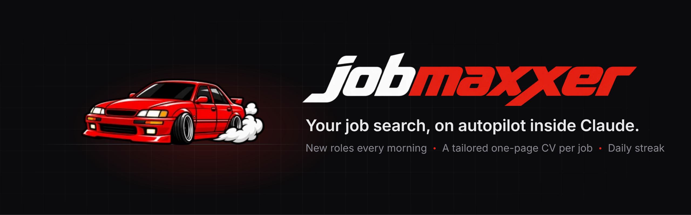
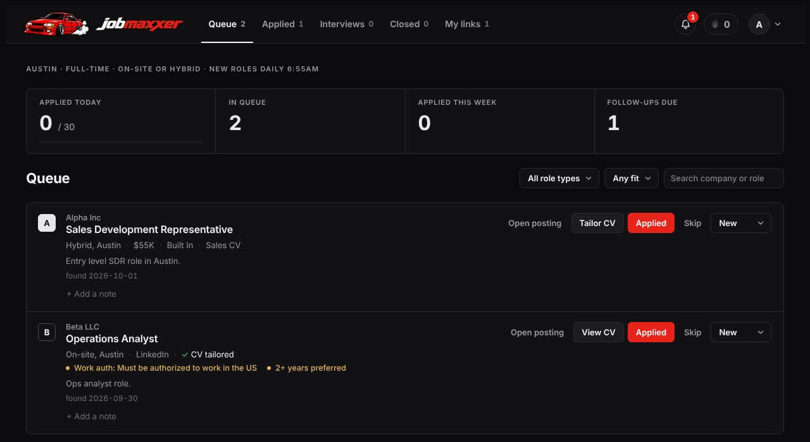

A job tracker that lives inside your own Claude. Every morning it finds new roles for you and grades how well each one fits. In one click it tailors a one-page CV for any job. You can also paste in your own links or job descriptions.

It runs as a private page (an "artifact") on your Claude account. Your jobs, CV and settings stay there, and nobody else can see them.

## What it does

- **Finds jobs every morning** for the roles, cities and level you choose, and grades each one A to C.
- **Tailors your CV for each job.** It writes a US-style CV that fills exactly one page and downloads as .docx or .pdf. It only uses true facts from your master CV, never made-up ones.
- **Helps you build a strong CV first.** You don't need a good CV to start. Claude interviews you, keeps everything you tell it, and writes the CV with you.
- **Drafts application answers** in your own voice.
- **Keeps you moving** with a daily goal, a streak, and reminders for follow-ups.

## Set it up (about 15 minutes)

You need a paid Claude plan with code running turned on (Settings, then Capabilities). You don't need a GitHub account.

Open a new chat at [claude.ai](https://claude.ai) or in the desktop app, attach your CV if you have one (PDF or Word is fine), and send this:

> Set up jobmaxxer for me. The code and instructions are in this public GitHub repo: https://github.com/dennycrafter/jobmaxxer-setup
>
> 1. Clone the repo (no account needed) and follow SETUP.md step by step.
> 2. If I already have a jobmaxxer artifact from an earlier try, republish to that same one so my data stays.
> 3. For my CV, follow setup/MASTER-CV-GUIDE.md. Start with what you already know about me from memory and past chats, use any files I attach, then interview me so I can add more. Never invent anything.
> 4. Keep everything here in the chat and talk to me in plain, simple words.

Claude publishes your tracker, builds your CV with you, asks what jobs and cities you want, and sets up the morning search. When it's done, open the tracker and you're ready.

## Using it

- **Queue:** new roles from the morning search. Open one to tailor your CV, download it, and draft answers to the application questions.
- **Applied, Interviews, Closed:** move jobs along as you go.
- **My links:** paste a job link or a whole job description. The details fill in by themselves.
- **Profile menu (top right):** your master CV, your preferences (rules for how your CV is written), and search settings.

Remembered something later, like an old job, a club or a number? Open any Claude chat and say *"Add this to my jobmaxxer master CV: ..."*. Claude asks a question or two and adds it.

## Good to know

- Everything runs on your own Claude plan. A bigger morning search uses more of it.
- Keep your tracker link private. Anyone you share it with can see and change your jobs.
- To change anything, open a chat with Claude, point it at this repo, and ask. `CLAUDE.md` tells Claude how to make changes safely.
